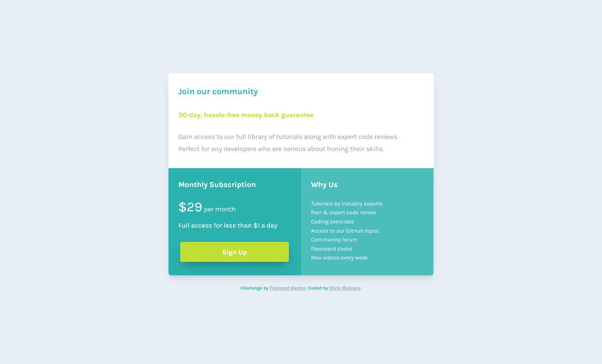

# Frontend Mentor - Single price grid component solution

This is a solution to the [Single price grid component challenge on Frontend Mentor](https://www.frontendmentor.io/challenges/single-price-grid-component-5ce41129d0ff452fec5abbbc). Frontend Mentor challenges help you improve your coding skills by building realistic projects. 

## Table of contents

- [Overview](#overview)
  - [The challenge](#the-challenge)
  - [Screenshot](#screenshot)
  - [Links](#links)
- [My process](#my-process)
  - [Built with](#built-with)
  - [What I learned](#what-i-learned)
- [Author](#author)

## Overview

### The challenge

Users should be able to:

- View the optimal layout for the component depending on their device's screen size
- See a hover state on desktop for the Sign Up call-to-action

### Screenshot

### Links

- Solution URL: [Frontend Mentor Solution](https://www.frontendmentor.io/challenges/single-price-grid-component-5ce41129d0ff452fec5abbbc/hub/mobile-first-sass-flexbox-single-price-grid-component-rJu2gJd89)
- Live Site URL: [Single Price Grid Component](https://chrismulvanygh.github.io/price-grid-component/)

## My process

### Built with

- Semantic HTML5 markup
- CSS custom properties
- Sass
- Flexbox
- Mobile-first workflow

### What I learned

Keep the solution simple and don't over think it.  You can always come back and change it.  Get the requirements met and submission done.

## Author

- Website - [Chris Mulvany](https://www.chrismulvany.com)
- Frontend Mentor - [@ChrisMulvanyGH](https://www.frontendmentor.io/profile/ChrisMulvanyGH)
- Twitter - [@ChrisMulvany](https://twitter.com/ChrisMulvany)
